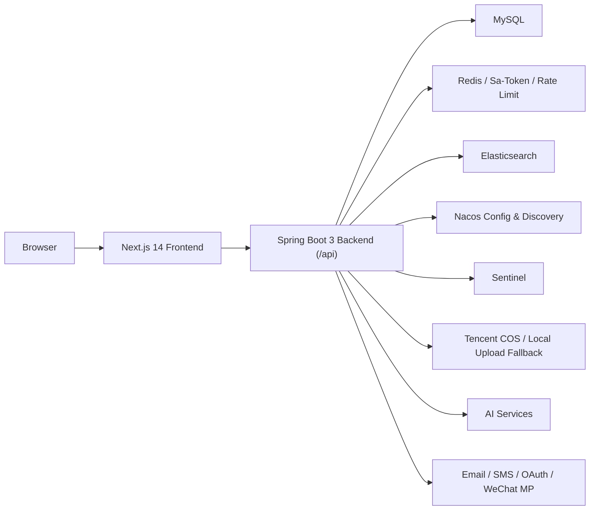

# IntelliFace 智面


> 一个面向求职与技术成长场景的智能面试题库系统。  
> 它把题库、刷题、题解、社区、学习数据、AI 模拟面试、简历驱动推荐、后台风控与运营配置整合到了一套完整的前后端应用里。

## 目录

- [项目简介](#项目简介)
- [核心能力](#核心能力)
- [技术架构](#技术架构)
- [技术栈](#技术栈)
- [项目结构](#项目结构)
- [页面与模块总览](#页面与模块总览)
- [数据模型概览](#数据模型概览)
- [依赖与运行前提](#依赖与运行前提)
- [本地快速启动](#本地快速启动)
- [配置说明](#配置说明)
- [Docker 部署](#docker-部署)
- [接口文档与 OpenAPI 客户端](#接口文档与-openapi-客户端)
- [常用命令](#常用命令)
- [开发建议](#开发建议)
- [常见问题](#常见问题)

## 项目简介

`IntelliFace`（中文品牌名：`智面`）是一个典型的前后端分离项目，目标不是只做“题目 CRUD”，而是把求职训练平台中常见的几条主线真正串起来：

1. 题库沉淀：支持题库、题目、标签、审核、收藏、刷题轨迹、私有笔记。
2. 社区内容：支持经验帖、评论、点赞、收藏、举报、精选与热门内容。
3. 用户成长：支持学习目标、签到、榜单、通知中心、公开主页、关注关系。
4. AI 能力：支持简历解析推荐、单题 AI 判题、语音答题判题、AI 模拟面试、AI 出题。
5. 运维治理：支持验证码、限流、风控告警、后台日志、动态系统设置、Nacos 配置中心、ES 同步补偿。

如果你正在做下面这类项目，这个仓库会很有参考价值：

- 面试题库 / 刷题平台
- 求职训练营 / 面试陪练平台
- 带社区能力的学习平台
- 适合做作品集、课程项目、毕设项目的完整全栈系统

## 核心能力

### 1. 题库与刷题

- 题库创建、编辑、审核、分页查询
- 题目创建、编辑、审核、批量删除、分页查询
- 题库和题目关联维护
- 题目难度、标签、推荐答案管理
- 题目收藏
- 刷题轨迹记录
- 学习时长统计
- 个人学习目标与晚间提醒
- 题目私有笔记
- 全站榜单、题库榜单
- 标签联想与推荐日志

### 2. AI 能力

- 简历文本解析推荐题目
- 简历文件解析推荐题目，支持 `txt / md / markdown / docx / pdf`
- 单题文本答题 AI 评估
- 单题语音答题 AI 转写 + AI 评估
- AI 模拟面试
  - 自定义岗位、经验、技术栈、难度、轮次
  - 支持开始、继续、暂停、结束
  - 支持流式追问
  - 支持语音转写输入
  - 支持语音播报面试官内容
  - 支持导出 Markdown 复盘报告
- 后台 AI 出题
  - 同步生成
  - 异步任务生成
  - 自动生成题面、标签、难度、参考答案

### 3. 社区内容

- 帖子发布、编辑、删除、检索
- 热门帖、精选帖、相关文章推荐
- 帖子点赞 / 收藏
- 帖子评论、回复、审核
- 帖子举报与后台处理

### 4. 用户与账号体系

- 账号密码登录
- 邮箱 / 手机验证码登录
- GitHub / Gitee / Google 第三方登录
- 微信公众号验证码登录 / 绑定
- 邮箱 / 手机绑定与解绑
- 第三方账号解绑
- 用户资料维护
- 用户公开主页
- 用户关注 / 粉丝关系
- 签到记录

### 5. 后台管理与治理

- 用户管理
- 题库管理
- 题目管理
- 社区管理
- 通知管理
- 评论审核
- AI 出题后台
- 模拟面试后台
- 风控面板
- 管理员操作日志
- 全局动态系统设置
  - 开放注册
  - 图形验证码
  - 维护模式
  - 游客访问开关
  - 学习提醒开关
  - 站内通知 / 邮件提醒开关

## 技术架构



### 架构说明

- 前端使用 `Next.js 14 App Router`，UI 主要基于 `Ant Design 5` 和 `Tailwind CSS`。
- 后端使用 `Spring Boot 3.2.4`，接口统一挂在 `/api` 前缀下。
- 认证体系使用 `Sa-Token + Redis`。
- 数据层基于 `MyBatis-Plus`。
- 搜索与推荐相关能力接入 `Elasticsearch`。
- 配置管理与服务发现接入 `Nacos`。
- 限流与治理引入 `Sentinel`，同时有基于 Redis 的自定义限流与 AI 调用限流。
- 对象存储优先使用 `腾讯云 COS`，本地开发可回退到项目目录 `uploads/`。

## 技术栈

### 后端

- Java 17
- Spring Boot 3.2.4
- Spring MVC
- Spring AOP
- Spring Session Data Redis
- MyBatis-Plus 3.5.5
- Sa-Token 1.44.0
- Spring Data Elasticsearch
- Knife4j OpenAPI 3
- Spring Cloud Alibaba
  - Nacos Discovery
  - Nacos Config
  - Sentinel
- Redisson
- Tencent COS SDK
- Tencent Cloud Java SDK（邮件）
- Aliyun dypnsapi20170525（号码验证 / 短信核验）
- Hutool
- EasyExcel
- PDFBox
- ip2region

### 前端

- Next.js 14.2.7
- React 18
- TypeScript 5
- Ant Design 5
- Ant Design Pro Components
- Tailwind CSS
- Redux Toolkit
- Axios
- ECharts
- ByteMD
- Lucide React
- `@umijs/openapi`

### 基础设施

- MySQL 8.x
- Redis 6.x / 7.x
- Elasticsearch 8.x（推荐）
- Nacos（测试 / 生产推荐）
- Sentinel Dashboard（可选）
- Docker / Docker Compose
- Nginx

## 项目结构

```text
.
├── src/main/java/com/xduo/springbootinit
│   ├── annotation        # 自定义注解（限流、分布式锁等）
│   ├── aop               # AOP 切面实现
│   ├── config            # Spring / MyBatis / CORS 等配置
│   ├── controller        # REST 接口层
│   ├── manager           # AI、COS、任务状态等管理类
│   ├── mapper            # MyBatis Mapper
│   ├── model             # DTO / Entity / VO / Enum
│   ├── service           # 业务服务接口与实现
│   ├── job               # 定时任务与启动同步任务
│   ├── satoken           # 认证相关扩展
│   ├── sentinel          # Sentinel 相关支持
│   └── utils             # 工具类
├── src/main/resources
│   ├── application.yml
│   ├── application-local.example.yml
│   ├── application-test.yml
│   ├── application-prod.yml
│   ├── mapper            # MyBatis XML
│   ├── templates         # 模板代码
│   └── ip2region         # 离线 IP 归属地库
├── src/test/java         # 后端测试
├── frontend
│   ├── src/app           # Next.js App Router 页面
│   ├── src/api           # OpenAPI 生成的接口客户端
│   ├── src/components    # 业务组件
│   ├── src/config        # 前端配置
│   ├── src/lib / libs    # 工具与请求封装
│   ├── src/stores        # Redux 状态管理
│   └── public/assets     # 静态资源
├── sql
│   ├── create_table.sql  # 全量建表脚本
│   └── import_data.sql   # 默认管理员与演示数据
├── docs/nacos            # Nacos 示例配置
├── deploy/nginx          # Nginx 反代配置
├── Dockerfile            # 后端镜像
├── frontend/Dockerfile   # 前端镜像
└── docker-compose.yml    # 前端 / 后端 / Nginx 编排
```

## 页面与模块总览

### 前端页面

| 页面 | 路径 | 说明 |
| --- | --- | --- |
| 首页 | `/` | 聚合展示题库、题目、榜单、精选帖、热门帖 |
| 题库列表 | `/banks` | 浏览公开题库 |
| 题库详情 | `/bank/[questionBankId]` | 查看题库内容与题库榜单 |
| 题目列表 | `/questions` | 浏览题目、筛选、搜索 |
| 题目详情 | `/question/[questionId]` | 查看题目、AI 判题、私有笔记、评论、推荐 |
| 社区列表 | `/posts` | 浏览帖子 |
| 帖子详情 | `/post/[postId]` | 查看帖子、评论、点赞、收藏 |
| 发帖页 | `/posts/create` | 发布社区内容 |
| AI 模拟面试创建页 | `/mockInterview/add` | 配置岗位、简历、技术栈、轮次 |
| AI 模拟面试记录页 | `/mockInterview` | 管理历史面试记录 |
| AI 模拟面试会话页 | `/mockInterview/chat/[mockInterviewId]` | 真实交互与复盘 |
| 登录页 | `/user/login` | 密码 / 验证码 / 公众号 / 第三方登录 |
| 注册页 | `/user/register` | 普通注册 |
| 个人中心 | `/user/center` | 资料、成长数据、收藏、笔记、简历推荐、安全设置 |
| 通知中心 | `/user/notifications` | 我的通知 |
| 用户主页 | `/user/[id]` | 对外公开用户主页 |
| 后台首页 | `/admin` | 后台概览 |
| 后台用户管理 | `/admin/user` | 用户管理 |
| 后台题库管理 | `/admin/bank` | 题库管理 |
| 后台题目管理 | `/admin/question` | 题目管理、评论审核 |
| 后台 AI 出题 | `/admin/question/ai` | AI 批量出题 |
| 后台社区管理 | `/admin/post` | 帖子管理 |
| 后台通知管理 | `/admin/notification` | 通知下发与记录 |
| 后台风控面板 | `/admin/security` | 异常访问与搜索告警 |
| 后台模拟面试管理 | `/admin/mockInterview` | 管理用户的模拟面试记录 |
| 后台日志中心 | `/admin/logs` | 管理员操作日志 |
| 后台系统设置 | `/admin/settings` | 动态站点配置 |

### 主要后端接口分区

| 控制器 | 基础路径 | 说明 |
| --- | --- | --- |
| `UserController` | `/api/user` | 注册、登录、绑定、资料、签到、公开主页 |
| `QuestionController` | `/api/question` | 题目 CRUD、搜索、推荐、AI 判题、AI 出题 |
| `QuestionBankController` | `/api/questionBank` | 题库 CRUD、审核、我的题库 |
| `QuestionBankQuestionController` | `/api/questionBankQuestion` | 题库-题目关系管理 |
| `UserQuestionHistoryController` | `/api/user_question_history` | 刷题轨迹、统计、学习目标 |
| `UserQuestionNoteController` | `/api/user_question_note` | 题目私有笔记 |
| `QuestionCommentController` | `/api/question/comment` | 题目评论与审核 |
| `PostController` | `/api/post` | 社区帖子 |
| `PostCommentController` | `/api/post/comment` | 社区评论与审核 |
| `MockInterviewController` | `/api/mockInterview` | AI 模拟面试、导出、语音、流式交互 |
| `NotificationController` | `/api/notification` | 站内通知 |
| `LeaderboardController` | `/api/leaderboard` | 全站榜单、题库榜单 |
| `SecurityAlertController` | `/api/security_alert` | 风控告警处理 |
| `SystemConfigController` | `/api/system_config` | 系统设置 |
| `AdminDashboardController` | `/api/admin/dashboard` | 后台概览 |
| `AdminOperationLogController` | `/api/admin/log` | 管理员操作日志 |
| `TagController` | `/api/tag` | 标签联想 |
| `FileController` | `/api/file` | 文件上传 |
| `WxMpController` | `/api/wx` | 微信公众号登录 / 绑定 |
| `GithubController` / `GiteeController` / `GoogleController` | `/api/user/login/*` | 第三方登录回调链路 |

## 数据模型概览

项目数据库并不只是一套“题目表 + 用户表”，而是包含了完整的学习、内容、运营与治理数据。

### 用户与关系

- `user`：用户
- `user_follow`：关注关系

### 刷题与题库

- `question_bank`：题库
- `question`：题目
- `question_bank_question`：题库与题目关联
- `question_favour`：题目收藏
- `user_question_history`：刷题轨迹
- `user_question_study_session`：学习时长会话
- `user_learning_goal`：每日学习目标
- `user_question_note`：题目私有笔记
- `question_comment`：题目评论
- `question_comment_like`：题目评论点赞
- `question_comment_report`：题目评论举报
- `question_recommend_log`：推荐曝光 / 点击日志
- `question_search_log`：搜索日志

### 社区

- `post`：帖子
- `post_thumb`：帖子点赞
- `post_favour`：帖子收藏
- `post_report`：帖子举报
- `post_comment`：帖子评论
- `post_comment_like`：帖子评论点赞

### AI 与运营

- `mock_interview`：AI 模拟面试记录与报告
- `notification`：站内通知
- `system_config`：系统动态配置
- `admin_operation_log`：管理员操作日志
- `security_alert`：风控告警
- `es_sync_task`：ES 同步补偿任务

完整建表脚本请直接查看 [`sql/create_table.sql`](sql/create_table.sql)。

## 依赖与运行前提

### 必需依赖

本地至少建议准备以下环境：

- JDK 17
- Node.js 20+
- npm 10+
- MySQL 8+
- Redis 6+ / 7+

### 推荐依赖

- Elasticsearch 8.x：题目 / 帖子搜索与索引同步能力更完整
- Nacos：测试 / 生产推荐使用
- Sentinel Dashboard：治理调试时有用

### 可选外部能力

这些能力不配也能开发核心功能，但对应模块会不可用或退化：

- 腾讯云 COS：文件上传正式存储
- 腾讯云邮件：验证码 / 学习提醒邮件
- 阿里云号码验证 / 短信：手机号验证码链路
- GitHub / Gitee / Google OAuth：第三方登录
- 微信公众号：公众号验证码登录与绑定
- AI 服务：
  - `ai.chat.*`：文本 AI，当前配置偏向 OpenAI 兼容接口 / DeepSeek
  - `ai.speech.*`：语音转写
  - `ai.tts.*`：语音播报

### 最小可用启动模式

如果你只是想先把项目跑起来，建议先用下面这套最小配置：

- 必配：`MySQL`、`Redis`
- 可先不配：`ES`、`COS`、`邮件`、`短信`、`OAuth`、`微信公众号`、`AI`
- 使用 `application-local.example.yml` 中默认策略：
  - `Nacos` 默认关闭
  - `短信 / 邮件` 默认 mock
  - `上传` 默认允许本地回退到 `uploads/`

## 本地快速启动

### 1. 克隆项目

```bash
git clone <your-repo-url>
cd IntelliFace
```

### 2. 创建本地配置文件

复制模板：

```bash
cp src/main/resources/application-local.example.yml src/main/resources/application-local.yml
```

然后按你的本机环境修改至少以下项目：

- `spring.datasource.*`
- `spring.data.redis.*`
- `spring.elasticsearch.*`（如启用 ES）
- `app.frontend-url`
- `app.cors.allowed-origin-patterns`

如果你暂时不接第三方能力，可以先保留示例值，但不要去点对应功能。

### 3. 初始化数据库

执行完整建表：

```bash
mysql -uroot -p < sql/create_table.sql
```

导入演示数据：

```bash
mysql -uroot -p intelligent_interview_question_bank_system < sql/import_data.sql
```

### 4. 默认管理员账号

执行 `sql/import_data.sql` 后会创建默认管理员：

- 账号：`admin`
- 密码：`12345678`

建议第一次登录后立即修改密码。

### 5. 启动后端

推荐使用 Maven Wrapper：

```bash
./mvnw spring-boot:run -Dspring-boot.run.profiles=local
```

也可以直接在 IDE 中启动：

- 启动类：`com.xduo.springbootinit.MainApplication`

后端默认地址：

- 接口根路径：`http://localhost:8101/api`
- Knife4j：`http://localhost:8101/api/doc.html`
- OpenAPI JSON：`http://localhost:8101/api/v2/api-docs`

### 6. 启动前端

安装依赖：

```bash
cd frontend
npm install
```

开发启动：

```bash
npm run dev
```

默认地址：

- 前端：`http://localhost:3000`

### 7. 是否需要执行 OpenAPI 生成

如果后端接口有变更，或者你第一次想重新生成前端 API 客户端，可以在后端启动后执行：

```bash
cd frontend
npm run openapi
```

它会读取：

- `http://localhost:8101/api/v2/api-docs`

并生成 / 更新：

- `frontend/src/api/*`

### 8. 本地联调建议

推荐按下面顺序启动：

1. MySQL
2. Redis
3. 后端
4. 前端
5. 如需 OpenAPI 生成，再执行 `npm run openapi`

## 配置说明

### 配置分层设计

项目做了比较清晰的配置分层：

| 文件 | 作用 |
| --- | --- |
| `src/main/resources/application.yml` | 仅放所有环境通用的基础配置 |
| `src/main/resources/application-local.example.yml` | 本地开发模板 |
| `src/main/resources/application-local.yml` | 你自己的本地真实配置，不提交到 Git |
| `src/main/resources/application-test.yml` | 测试环境最小启动配置 |
| `src/main/resources/application-prod.yml` | 生产环境最小启动配置 |
| `docs/nacos/common.example.yml` | Nacos 共享配置 `common.yml` 示例 |
| `docs/nacos/Intelligent-interview-question-bank-system.example.yml` | Nacos 应用专属配置示例 |

### 本地开发模式

`application-local.example.yml` 已经帮你做好了这些默认策略：

- `spring.cloud.nacos.discovery.enabled=false`
- `spring.cloud.nacos.config.enabled=false`
- `knife4j.enable=true`
- `app.email.mock-enabled=true`
- `app.sms.mock-enabled=true`
- `app.upload.local-fallback-enabled=true`

这意味着你可以先不接 Nacos、短信、邮件、COS，也能把核心业务功能跑起来。

### Nacos 推荐用法

测试 / 生产环境推荐把强环境相关配置放进 Nacos，而不是写死在包内配置里。

推荐至少创建以下 Data ID：

- `common.yml`
- `Intelligent-interview-question-bank-system.yml`

可选：

- `black-ip-list.yml`

示例文件位置：

- `docs/nacos/common.example.yml`
- `docs/nacos/Intelligent-interview-question-bank-system.example.yml`

### 关键配置项说明

#### 数据库 / Redis / ES

- `spring.datasource.*`：MySQL 连接
- `spring.data.redis.*`：Redis 连接
- `spring.elasticsearch.*`：Elasticsearch 连接

#### 登录 / 认证 / 跨域

- `sa-token.*`：认证 Token 行为
- `app.frontend-url`：前端地址
- `app.cors.allowed-origin-patterns`：允许跨域来源

前端请求默认带 `withCredentials=true`，所以跨域配置必须和前端域名保持一致。

#### 上传

- `cos.client.*`：腾讯云 COS 配置
- `app.upload.local-fallback-enabled`：未配置 COS 时是否允许本地落盘
- `app.upload.local-dir`：本地上传目录

#### AI

- `ai.chat.*`：文本 AI
- `ai.speech.*`：语音转写
- `ai.tts.*`：语音合成
- `ai.rate-limit.*`：AI 接口调用限流

#### 邮件 / 短信 / 第三方登录

- `tencent.email.*`
- `aliyun.sms.*`
- `social.github.*`
- `social.gitee.*`
- `social.google.*`
- `wechat.mp.*`

#### 搜索同步与补偿

- `app.es-sync.compensation.*`：MySQL -> ES 失败补偿
- `app.es-sync.question.*`：题目索引同步
- `app.es-sync.post.*`：帖子索引同步
- `app.es-sync.tag.*`：标签索引同步

#### 风控与 IP 归属地

- `app.ip-location.*`
- `nacos.config.sync-enabled`
- `nacos.config.data-id=black-ip-list.yml`

### ES 同步策略

项目不是简单“写数据库同时写 ES”，而是做了更稳妥的同步兜底：

1. 正常写业务数据
2. 同步 ES
3. 如果 ES 写失败，记录补偿任务到 `es_sync_task`
4. `RetryEsSyncTaskJob` 定时重试补偿

另外还提供：

- `FullSyncQuestionToEs`
- `FullSyncPostToEs`
- `FullSyncTagToEs`
- `IncSyncQuestionToEs`
- `IncSyncPostToEs`

其中：

- 标签全量同步默认启动时执行
- 题目 / 帖子增量同步默认关闭，需要通过配置显式开启

### 系统动态配置

后台 `系统设置` 页面接入了真实后端配置，保存后会直接影响：

- 注册开关
- 图形验证码要求
- 维护模式
- 游客访问题目 / 社区权限
- 站内通知
- 邮件提醒
- 学习目标提醒任务

## Docker 部署

### 部署前先知道一件事

仓库中的 `docker-compose.yml` 只编排了：

- `backend`
- `frontend`
- `nginx`

它**没有**把下面这些基础设施打进去：

- MySQL
- Redis
- Elasticsearch
- Nacos
- Sentinel

也就是说，这份 Compose 更像“应用层部署编排”，而不是“全家桶一键本地体验环境”。

### 后端镜像

根目录 `Dockerfile` 做了两阶段构建：

1. `maven:3.9.6-eclipse-temurin-17` 编译打包
2. `eclipse-temurin:17-jre` 运行 Jar

默认以 `prod` 配置启动：

```bash
java -jar /app/app.jar --spring.profiles.active=prod
```

### 前端镜像

`frontend/Dockerfile` 也做了三阶段构建：

1. 安装依赖
2. `next build`
3. 使用 `standalone` 产物运行

前端 `next.config.mjs` 已启用：

- `output: "standalone"`
- 生产环境图片 `unoptimized: true`

这是为了避免 standalone 容器内缺少运行时图片优化依赖导致 `_next/image` 报错。

### Docker Compose 关键点

#### 后端

- 容器端口：`8101`
- 挂载卷：`uploads-data:/app/uploads`
- 通过环境变量注入 Nacos / Sentinel 相关配置

#### 前端

- 容器端口：`3000`
- `API_BASE_URL=http://backend:8101`
- `NEXT_PUBLIC_API_BASE_URL=""`

这个设计非常重要：

- 前端服务端渲染请求走 `http://backend:8101`
- 浏览器请求走相对路径 `/api/...`
- 最终统一通过 Nginx 同域代理，减少 Cookie 与 CORS 问题

#### Nginx

- 监听 `80` 和 `443`
- `/api/` 代理到后端
- `/_next/` 与 `/` 代理到前端

### 部署步骤

#### 1. 准备 Nacos 配置

至少准备：

- `common.yml`
- `Intelligent-interview-question-bank-system.yml`

内容可以参考：

- `docs/nacos/common.example.yml`
- `docs/nacos/Intelligent-interview-question-bank-system.example.yml`

#### 2. 修改 Nginx 配置占位符

文件：

- `deploy/nginx/default.conf`

需要把以下占位符替换成真实域名：

- `<Your Domain>`

同时准备证书文件：

- `/etc/nginx/certs/<Your Domain>.pem`
- `/etc/nginx/certs/<Your Domain>.key`

Compose 默认把宿主机目录映射为：

- `${NGINX_CERTS_DIR:-/opt/intelliface/certs}`

#### 3. 准备环境变量

至少关注这些变量：

```bash
NACOS_DISCOVERY_SERVER_ADDR=your-nacos-host:8848
NACOS_CONFIG_SERVER_ADDR=your-nacos-host:8848
NACOS_DISCOVERY_USERNAME=
NACOS_DISCOVERY_PASSWORD=
NACOS_CONFIG_USERNAME=
NACOS_CONFIG_PASSWORD=
SENTINEL_DASHBOARD=
NGINX_HTTP_PORT=80
NGINX_HTTPS_PORT=443
NGINX_CERTS_DIR=/opt/intelliface/certs
```

#### 4. 构建并启动

```bash
docker compose up -d --build
```

### 部署建议

- 推荐前后端走同一主域名，由 Nginx 统一反代
- 生产环境不要把敏感配置直接写进仓库文件，统一交给 Nacos
- 如果使用 COS，生产环境建议关闭本地回退上传
- 生产环境建议关闭 `Knife4j`，或者加基础认证

## 接口文档与 OpenAPI 客户端

### 在线接口文档

开发环境默认保留：

- Knife4j：`http://localhost:8101/api/doc.html`


### OpenAPI 文档地址

- `http://localhost:8101/api/v2/api-docs`

### 前端客户端生成

前端通过 `@umijs/openapi` 生成接口代码：

- 配置文件：`frontend/openapi.config.ts`
- 输出目录：`frontend/src/api`

执行命令：

```bash
cd frontend
npm run openapi
```

建议在以下场景执行：

- 后端新增接口
- 后端 DTO / VO 结构调整
- 你刚拉下代码，想确认客户端与当前后端接口一致

## 常用命令

### 后端

```bash
./mvnw spring-boot:run -Dspring-boot.run.profiles=local
./mvnw -DskipTests package
./mvnw test
```

### 前端

```bash
cd frontend
npm install
npm run dev
npm run build
npm run start
npm run lint
npm run openapi
```

### Docker

```bash
docker compose up -d --build
docker compose logs -f backend
docker compose logs -f frontend
docker compose logs -f nginx
```

## 开发建议

### 1. 先跑最小闭环，再逐个接入外部能力

推荐顺序：

1. MySQL
2. Redis
3. 后端
4. 前端
5. 再接入 ES
6. 再接入 AI
7. 最后接入 COS / 邮件 / 短信 / OAuth / 微信公众号

### 2. 本地优先走 `application-local.yml`

不要直接改 `application-local.example.yml`；它应该始终保持为模板。

### 3. 前后端接口变更后记得更新客户端

后端 DTO 改了，但前端没重新 `npm run openapi`，通常就会出现类型不一致或请求字段缺失。

### 4. 跨域问题尽量用“同域反代”思路解决

这个项目的认证链路依赖 Cookie / Session，生产环境最省心的方式仍然是：

- 浏览器访问同一个主域名
- `/api` 由 Nginx 反代到后端
- 页面资源反代到前端

### 5. AI 功能是增强项，不是启动前置项

如果你暂时没有 AI Key，也完全可以先完成：

- 用户系统
- 题库 / 题目
- 社区
- 管理后台

等核心流程稳定以后，再把 AI 相关配置补上。

## 常见问题

### 1. 启动后端时报数据库连接失败

先检查：

- `src/main/resources/application-local.yml` 是否已创建
- `spring.datasource.url / username / password` 是否正确
- 本地 MySQL 数据库是否已创建

### 2. 登录接口一直 401 或浏览器状态丢失

重点检查：

- `app.frontend-url`
- `app.cors.allowed-origin-patterns`
- 前端请求是否走了正确域名
- 是否通过 Nginx 统一反代

### 3. `npm run openapi` 失败

通常是因为后端还没起来，或者文档地址不可访问。先确认：

- `http://localhost:8101/api/v2/api-docs`

可以正常打开。

### 4. Docker 启动后 HTTPS 不可用

检查：

- `deploy/nginx/default.conf` 里的 `<Your Domain>` 是否替换
- 证书目录是否挂载正确
- 证书文件名是否与配置一致

### 5. 上传失败

本地开发时，优先确认：

- `app.upload.local-fallback-enabled=true`

如果你希望走 COS，再补齐：

- `cos.client.accessKey`
- `cos.client.secretKey`
- `cos.client.region`
- `cos.client.bucket`

### 6. AI 功能报“请先配置 AI API Key”

说明你触发了 AI 模块，但还没有配置：

- `ai.chat.api-key`
- `ai.speech.api-key`
- `ai.tts.api-key`

### 7. 生产环境为什么推荐 Nacos

因为这个项目的环境相关配置项很多，包括：

- 数据库
- Redis
- Elasticsearch
- CORS
- 前端域名
- COS
- 邮件 / 短信
- OAuth
- 微信公众号
- AI 服务

生产环境统一交给 Nacos 管理，会比把这些东西分散在多个静态 yml 文件里更可控。